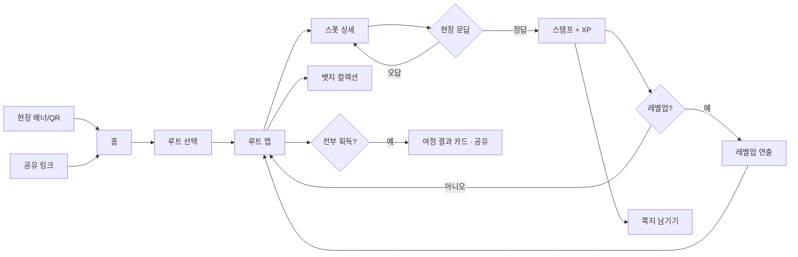

# 잡고(JABGO) MVP PRD

> 작성일 2026-09-12 · 상태: 리뷰 요청 · 맥락: 해커톤 사이드프로젝트(30분 제약)
> **탐색 워크시트 생략.** 시간 제약상 후보 비교·버린 안 기록을 본 문서 1번에 압축해 넣었다.
> MVP 기준 문서. 확정된 것만 적고 나머지는 5번 미결로 올린다.

## 0. 한 장 요약

| 항목 | 내용 |
|---|---|
| 해결하는 문제 | 차이나타운 방문객이 "패루-공화춘-벽화거리"만 찍고 90분 만에 떠난다. 골목 안쪽은 존재조차 모른 채 끝난다 |
| 대상 사용자 | 인천 차이나타운 **첫 방문 관광객**(1회성, 체류 2~4시간, 앱 설치 의향 없음) |
| 이번 범위 | 오늘의 루트 / 현장 문답 스탬프 / 뱃지·레벨 / 다음 여행자 쪽지 |
| 이번 범위 아님 | 회원가입, 가게 제휴·정산, 별점 리뷰, 네이티브 앱, 인천 외 지역 |
| 성공 판단 기준 | 루트 시작자의 절반 이상이 스탬프 3개 이상 획득(= 골목 진입 성공) |
| 미결 항목 | 5건 (5번) |

## 1. 배경

기존 관광 스탬프투어의 실패 패턴은 셋이다. ⓐ 경품이 목적이라 경품 소진 즉시 이용이 0이 된다. ⓑ 레벨·누적 보상이 재방문을 전제하는데 관광지 방문객은 1회성이라 대다수가 초반 레벨에서 멈춘다. ⓒ 보상으로 리뷰를 유도해 전부 5점이 되고 리뷰가 죽는다.

잡고는 세 전제를 모두 뒤집는다. 성장 단위를 **유저 생애가 아니라 하루의 여정**으로 잡아 1회 방문 안에서 성장 곡선이 완결되게 한다. 별점을 버리고 **다음 여행자가 실제로 읽는 쪽지**로 대체해 인플레이션 대상 자체를 없앤다. 그리고 사장님 제휴가 불가능한 상황(인터뷰만 진행)에서 **현장에 있어야만 풀리는 문답**으로 방문을 증명한다 — QR 부착도, POS 연동도 필요 없다.

**검토했으나 버린 안**

| 버린 안 | 이유 | 다시 검토할 조건 |
|---|---|---|
| 가게 QR 스캔 | 제휴 불가. 사진 공유로 원격 획득 가능 | 상인회 공식 제휴 성사 시 |
| GPS 단독 인증 | 웹 GPS는 밀집 지역 오차 수십 m, 스푸핑 용이 | 네이티브 앱 전환 시 |
| 별점 리뷰 | 네이버·카카오 대비 우위 없음 + 보상 연동 시 인플레 | 가게 상세 정보 제공자가 될 때 |
| 누적 레벨(생애) | 1회성 방문자에게 좌절 신호로 작동 | 로컬 재방문자로 타깃 전환 시 |

**맥락 미확인 영역**
실제 가게 인터뷰 내용, 방문객 실 체류시간·동선 데이터, 지역 관광 통계. 전부 미확보 상태로 진행했다.

## 2. 전역·중요 정책

### 2-1. 권한 정책
| 역할 | 가능한 동작 | 제한 |
|---|---|---|
| 비로그인 방문자 | 루트 탐색·스탬프·뱃지·레벨·쪽지 작성 전부 | 기기 로컬 저장. 기기 변경 시 진행도 소실 |
| 관리자(운영) | 스폿·미션·쪽지 관리 | MVP 범위 밖(수동 운영) |

**가입 없음이 정책이다.** 관광객에게 회원가입은 최대 이탈 지점이다.

### 2-2. 상태 전이
| 현재 상태 | → 가능한 상태 | 조건 | 되돌리기 |
|---|---|---|---|
| 스폿: 미방문 | 도전중 | 스폿 카드 진입 | 가능(이탈) |
| 도전중 | 획득 | 문답 정답 | **불가** |
| 도전중 | 도전중 | 오답 | 즉시 재시도 가능, 횟수 제한 없음 |
| 여정: 진행중 | 완주 | 루트 내 스폿 전부 획득 | 불가 |

**스탬프 회수·차감은 없다.** 되돌릴 수 있는 성취는 성취가 아니다.

### 2-3. 데이터 정책
- 진행도는 기기 로컬에 저장. 서버 계정 없음.
- 쪽지는 스폿에 귀속되며 작성자 식별 정보를 저장하지 않는다(칭호만 표시).
- 쪽지 삭제·수정 없음 — 작성 전 확인으로 대체.

### 2-4. 과금·한도 영향
**없음.** 무료. 경품·쿠폰 없음(경품 소진형 실패 패턴을 의도적으로 회피).

## 3. 기능 명세

### F-1. 오늘의 루트

- **페이지 카테고리**: 홈 / 루트 맵
- **대상 사용자**: 전체(비로그인 포함)
- **자잘한 정책**: 루트는 2~3개 제시. 스폿 수 4~6개, 도보 예상시간 표기. 루트 변경은 언제든 가능하되 획득 스탬프는 유지.

**BDD — 정상 흐름**
```
Given 처음 접속한 방문자가 홈에 있고
When  "골목 미식 루트"를 선택하면
Then  해당 루트의 스폿 4개가 맵에 순서 없이 표시되고 진행도 0/4가 보인다
```
**BDD — 예외: 위치 권한 거부**
```
Given 방문자가 브라우저 위치 권한을 거부했고
When  루트를 시작하면
Then  거리 표시 없이 목록형으로 진행되며 스탬프 획득은 문답만으로 가능하다
```

**완료 조건**
- [ ] 루트 선택 후 3초 내 맵·진행도 렌더링
- [ ] 위치 권한 거부 상태에서도 전체 흐름이 끝까지 동작한다
- [ ] 스폿은 순서 강제 없이 아무거나 먼저 방문 가능하다

### F-2. 현장 문답 스탬프

- **페이지 카테고리**: 스폿 상세
- **대상 사용자**: 전체
- **자잘한 정책**: 문답은 현장에서 눈으로 확인해야만 알 수 있는 것만 출제(간판 글자 수, 계단 단수, 벽화 속 인물 등). 오답 시 힌트 1회 제공. 정답 시 스탬프 애니메이션 + XP 획득.

**BDD — 정상 흐름**
```
Given 방문자가 스폿 반경 근처에 있고 스폿 카드를 열었고
When  현장 문답에 정답을 입력하면
Then  스탬프가 찍히고 XP가 적립되며 진행도가 +1 된다
```
**BDD — 예외: 원격 시도**
```
Given 방문자가 스폿에서 멀리 떨어져 있고
When  스폿 카드를 열면
Then  "현장에서 열어주세요" 안내가 뜨고 문답이 잠긴다 (위치 미허용 시에는 문답만으로 통과)
```

**완료 조건**
- [ ] 정답 처리 후 1초 내 스탬프·XP 반영, 새로고침 없이
- [ ] 오답 횟수에 따른 차단·페널티가 없다
- [ ] 동일 스폿 중복 획득이 불가능하다

### F-3. 뱃지 컬렉션 & 여정 레벨

- **페이지 카테고리**: 컬렉션 / 상단 HUD
- **대상 사용자**: 전체
- **자잘한 정책**: 레벨은 **오늘의 여정 내에서** Lv.1 관광객 → Lv.2 산책자 → Lv.3 골목탐험가 → Lv.4 차이나타운 통(通)으로 오른다. 미획득 뱃지는 실루엣으로 노출해 남은 목표를 보이게 한다.

**BDD — 정상 흐름**
```
Given 방문자가 XP 임계치 직전이고
When  스탬프를 하나 더 획득하면
Then  레벨업 연출이 뜨고 칭호가 갱신되며 새 뱃지가 잠금 해제된다
```
**BDD — 예외: 중도 이탈 후 복귀**
```
Given 방문자가 브라우저를 닫았다가 같은 기기로 다시 들어왔고
When  홈에 진입하면
Then  이전 진행도·레벨이 그대로 복원되고 "n개 남았습니다"가 먼저 보인다
```

**완료 조건**
- [ ] 미획득 뱃지의 획득 조건이 화면에서 읽힌다
- [ ] 재진입 시 진행도가 소실되지 않는다(동일 기기·브라우저 기준)
- [ ] 레벨 상한 도달 후에도 스탬프 획득이 정상 동작한다

### F-4. 다음 여행자에게 남기는 쪽지

- **페이지 카테고리**: 스폿 상세 하단
- **대상 사용자**: 해당 스폿 스탬프 획득자만 작성 가능. 열람은 전체.
- **자잘한 정책**: 별점 없음. 태그 선택(최대 2개) + 40자 이내 한 줄. **쪽지 작성은 XP를 주지 않는다** — 보상과 분리해 인플레이션을 차단한다. 대신 "내 쪽지를 n명이 봤어요"로 되돌려준다.

**BDD — 정상 흐름**
```
Given 방문자가 스폿 스탬프를 획득했고
When  태그를 고르고 한 줄을 남기면
Then  쪽지가 해당 스폿에 즉시 노출되고 다음 방문자에게 보인다
```
**BDD — 예외: 미획득자 작성 시도**
```
Given 스탬프를 획득하지 않은 방문자가 스폿 상세에 있고
When  쪽지 입력란을 보면
Then  입력이 잠기고 "스탬프를 먼저 잡아주세요"가 표시된다
```

**완료 조건**
- [ ] 미획득자는 쪽지를 작성할 수 없다
- [ ] 쪽지 작성으로 XP·레벨이 변하지 않는다
- [ ] 쪽지 0건 스폿에서도 화면이 비어 보이지 않는다(안내 문구 노출)

## 4. 화면 흐름



| 진입 경로 | 들어오는 역할 | 비로그인 가능 |
|---|---|---|
| 현장 배너·포스터 QR | 첫 방문 관광객 | 가능 |
| 공유된 결과 카드 링크 | 지인 소개 유입 | 가능 |
| 직접 URL | 재방문자 | 가능 |

## 5. 미결 항목

| # | 질문 | 왜 필요한가 | 결정 영역 | 기한 |
|---|---|---|---|---|
| 1 | 문답 정답을 클라이언트에 둘 것인가 | 지금 구조는 소스 열람으로 정답 노출 가능. 데모는 감수, 실서비스는 서버 검증 필요 | 기술 | 실서비스 전 |
| 2 | 쪽지 신고·비속어 처리 | 익명 작성이라 악용 소지. MVP는 무방비 | 제품 | 공개 배포 전 |
| 3 | 실제 스폿·문답 콘텐츠를 누가 만드나 | 현장 확인이 필요한 문제라 제작 비용이 실제 병목 | 제품/비즈니스 | 파일럿 전 |
| 4 | 진행도를 기기 로컬로 둘 것인가 | 기기 변경·시크릿모드 시 전부 소실. 가입 없이 해결할 방법 필요 | 기술 | 파일럿 전 |
| 5 | 실제 상호를 사용할 때의 동의 범위 | 인터뷰만 했을 뿐 게재 동의는 없음 | 비즈니스 | 실명 게재 전 |

## 6. 미확정 기술 결정

| 항목 | 선택지 | 결정에 필요한 정보 |
|---|---|---|
| 문답 검증 위치 | 클라이언트 / 서버 API | 부정 획득을 어디까지 감수할지 |
| 위치 판정 | Geolocation 반경 / 미사용 | 골목 밀집 구간 실측 오차 |
| 진행도 저장 | localStorage / 익명 토큰+서버 | 기기 변경 대응 필요 여부 |
| 쪽지 저장 | 로컬(데모) / 공유 DB | 다중 사용자 데모 필요 여부 |

## 7. 범위 밖

회원가입·소셜로그인, 가게 제휴·쿠폰·정산, 별점 리뷰, 랭킹·친구, 푸시 알림, 네이티브 앱, 다국어, 인천 외 지역.

## 8. 가정과 잔여 질문

**가정으로 처리한 것**

| 가정 | 왜 이렇게 뒀나 | 틀렸을 때 무너지는 것 |
|---|---|---|
| 방문객은 1회성이며 재방문하지 않는다 | 관광지의 일반적 성격 | 누적 레벨이 더 나은 설계가 되어 F-3 전면 재설계 |
| 현장에서만 풀 수 있는 문답을 낼 수 있다 | 간판·계단·벽화 등 고정 피사체 존재 | 인증 수단이 사라져 제품 근간이 무너짐 |
| 사장님 협조 없이도 스폿 운영이 가능하다 | 랜드마크·거리 중심 구성 | 스폿 풀이 급감해 루트가 성립하지 않음 |
| 경품 없이도 수집 동기가 작동한다 | 컬렉션·완주 자체의 내적 동기 | 참여율 급락, 외적 보상 재설계 필요 |

**아직 확인하지 못한 것**
- 실제 방문객 체류 동선, 골목 진입률
- 문답 콘텐츠 제작 공수(스폿당 소요 시간)
- 사장님 인터뷰에서 나온 실제 니즈

**방향은 확정됐지만 세부가 열려 있는 지점**
- 레벨 4단계의 XP 임계값(데모는 임의값)
- 루트 구성 기준(테마별/거리별)

## 9. 리뷰에서 봐줬으면 하는 것

① "1회 방문 안에서 완결되는 레벨"이 실제로 동기로 작동할지 — 여기가 이 기획의 승부처다.
② 현장 문답이 인증 수단으로 충분한지, 아니면 그냥 귀찮은 관문인지.
③ 쪽지에서 XP를 뺀 결정 — 작성률이 0에 수렴할 위험을 감수할 만한지.

## 10. 다음 단계에서 다룰 것

지역 확장(부산 초량·서울 서린), 서버 기반 쪽지 공유, 상인회 제휴형 리워드, 문답 CMS. 현재 설계는 스폿·문답·루트가 데이터로 분리돼 있어 지역 추가 시 콘텐츠만 늘리면 된다.
